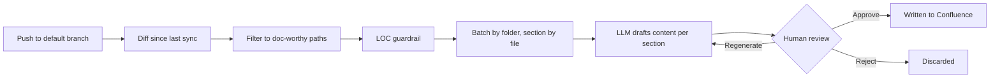
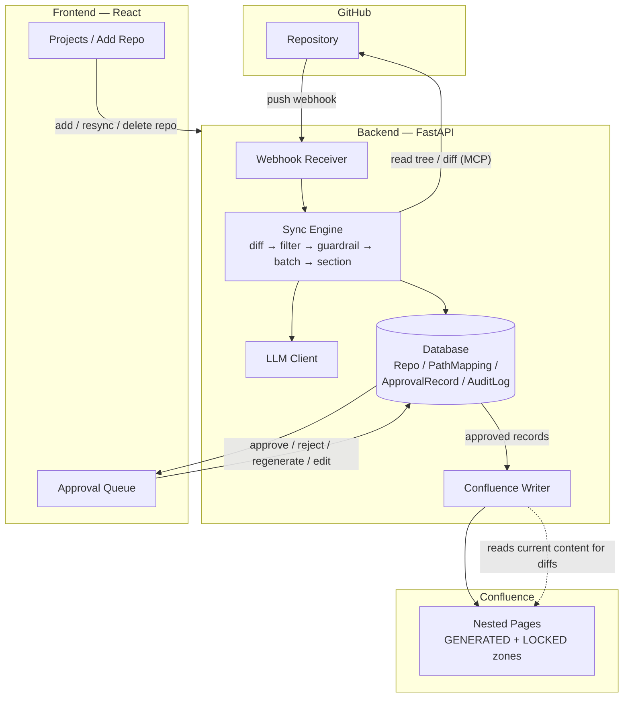

# Documentify

Documentation and code drift apart. Documentify keeps them in sync: it watches a GitHub repo's default branch, drafts documentation updates for whatever changed whenever a git push is done, and proposes them as edits to a Confluence space — a human reviews and approve the  changes before they get written.

## The problem

Every team starts a wiki with good intentions. Then the codebase moves and the wiki doesn't. Nobody deliberately decides to let docs go stale — it just happens, one deadline at a time, until the wiki describes a system that no longer exists. New engineers ramp up on outdated architecture notes. PMs read feature descriptions that shipped differently six months ago. The wiki becomes something people stop trusting, then stop checking, then stop maintaining entirely — a slow death spiral that starts the moment "update the docs" becomes a step someone can choose to skip.

The root cause isn't laziness — it's that keeping docs in sync with code has always been a manual, unenforced step, disconnected from the commit that actually changed the behavior.

## Existing solutions (and why they fall short)

- **Manually maintained wikis** (Confluence, Notion, plain README files) — flexible and readable, but nothing connects them to the code. Staying current depends entirely on someone remembering to go edit a separate page.
- **Auto-generated API docs** (Swagger/OpenAPI, Sphinx, JSDoc, Javadoc) — accurate for function signatures and types, but they describe *what exists*, not *what changed or why*. No narrative, no architecture notes, and still need a manual generate-and-publish step.
- **Docs-as-code static sites** (Docusaurus, MkDocs, GitBook) — docs live in the repo and version alongside it, which helps, but the actual writing is still 100% manual. The sync problem just moves into the same repo instead of going away.

What's missing across all of them: something that watches the diff itself, drafts the update automatically, and writes it to the wiki your team *already uses* — without asking anyone to migrate documentation platforms or write anything by hand, while still keeping a human as the final gate before anything goes live.

## Approach



Every push triggers an incremental diff against the last commit Documentify actually synced — not a full re-scan. Irrelevant paths (lockfiles, build artifacts, generated code) are filtered out, and a lines-of-change guardrail stops a huge or noisy push from burning LLM calls on something no one will approve anyway. What's left gets batched by folder (nested to match the real directory structure) and split into per-file sections, and each one gets a drafted content update from an LLM, grounded in the actual diff and commit messages — never speculation.

Nothing reaches Confluence until a human approves it. Every proposal can be approved, rejected, regenerated with feedback, or edited by hand first. Approved content is written inside anchored `GENERATED` zones that Confluence itself preserves — a human can add their own notes in an adjacent `LOCKED` zone on the same page, and future syncs will only ever touch the generated part, never overwrite what a person wrote.

## Architecture



The backend never writes to Confluence outside the approval gate — `write_approval` requires a real, approved `ApprovalRecord` id as a structural precondition, not a convention. The database is the single source of truth for what's pending, what's been approved, and a full audit trail of every write attempt and its outcome.

## Screenshots

Drop image files into `docs/screenshots/` with the filenames below and they'll show up here automatically.

**Projects — onboarded repos, add a new one**


**Add Repo — background sync progress**


**Approval Queue — bulk select and review**


**Approval detail — side-by-side diff**


**Resulting Confluence page**


## Future steps

- **Hosted multi-tenant version** — sign in with GitHub, connect Confluence via OAuth, no self-hosting required. Today's self-hosted model needs each adopter to run their own instance and manage their own `.env`.
- **Real production deployment** — backend on a proper host with TLS, frontend on a CDN, containerized for repeatable deploys.
- **Notifications** — Slack/email pings when new approvals land, instead of needing to check the queue.
- **More documentation targets** — Notion, GitHub Wiki, or a plain static site, not just Confluence.
- **Finer-grained diffing** — line-level content updates instead of regenerating a whole section, for tighter, more reviewable diffs.
- **Enforced approver roles** — structural vs. content approval is modeled in the data already; not yet gated in the UI.

## How to clone and use it

```bash
git clone https://github.com/AmbarSinha24/DocSync.git
cd DocSync
./start.sh
```

`start.sh` sets up the backend virtualenv, installs frontend dependencies, starts both servers, and opens the app in your browser. It'll warn if `backend/.env` is missing — you'll need real credentials before anything actually syncs.

For the full setup guide — obtaining a Confluence API token and root page ID, a GitHub token, generating a webhook secret, and onboarding your first repo — see **[docs/SELF_HOSTING.md](docs/SELF_HOSTING.md)**.

- `backend/` — FastAPI service: GitHub webhook receiver, the diff/generate/approve pipeline, and the Confluence writer.
- `frontend/` — React app for reviewing and approving proposed doc changes, and for onboarding new repos.
